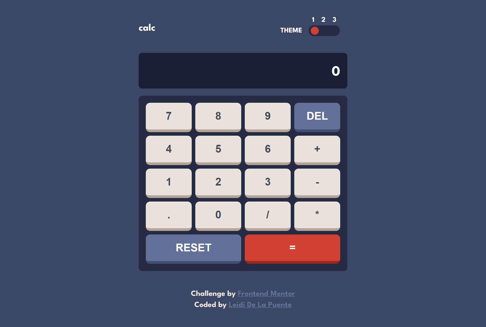

# Frontend Mentor - Calculator app solution

This is a solution to the [Calculator app challenge on Frontend Mentor](https://www.frontendmentor.io/challenges/calculator-app-9lteq5N29). Frontend Mentor challenges help you improve your coding skills by building realistic projects. 

## Table of contents

- [Overview](#overview)
  - [The challenge](#the-challenge)
  - [Screenshot](#screenshot)
  - [Links](#links)
- [My process](#my-process)
  - [Built with](#built-with)
  - [What I learned](#what-i-learned)
  - [Continued development](#continued-development)
- [Author](#author)

## Overview

### The challenge

Users should be able to:

- See the size of the elements adjust based on their device's screen size
- Perform mathematical operations like addition, subtraction, multiplication, and division
- Adjust the color theme based on their preference

### Screenshot




### Links

- Solution URL: [Add solution URL here](https://github.com/leidi2004/calculator)
- Live Site URL: [Add live site URL here](https://leidi2004.github.io/calculator/)

## My process

### Built with

- Semantic HTML5 markup
- Sass
- Flexbox
- CSS Grid
- Mobile-first workflow

### What I learned

I read about some array's methods, and i used join.

If you see the projects i did in javascript in the past weeks you'll see that i have all the important code in an event listener of a button or in an input and just some functions. This time at the beginning i was doing the same, but i'm using an IA to give me feedback and corrections of my code, and I follow its correction this time and I encapsulate my code into functions.  
 
This is my main code:

```js
buttons.forEach(button => {
    button.addEventListener("click", () => {
        let array = displayValues(button);
        operate(button, array, btnEquals);
    });
});

btnReset.addEventListener("click", reset);

btnPoint.addEventListener("click", () => {
    let clicked = false;
    if (!clicked) {
        btnPoint.disabled = true;
        clicked = true;
    }
});
```

I'm learning and improving while coding, I still have to get use to add comments to my code, organize it better and give to the variables better names. 

### Continued development

I want to keep doing projects where I have to use array and its methods because when I coded in Java i wasn't a fan of arrays but in JavaScript are very useful.

I want to keep encapsulating my code into functions, writing more clean code and improving my problem solving skills.

## Author

- Github - [Leidi De La Puente](https://github.com/leididelapuente13)
- Frontend Mentor - [@leididelapuente13](https://www.frontendmentor.io/profile/leididelapuente13)
